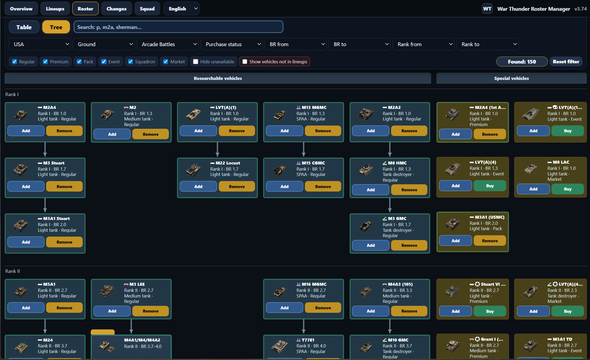
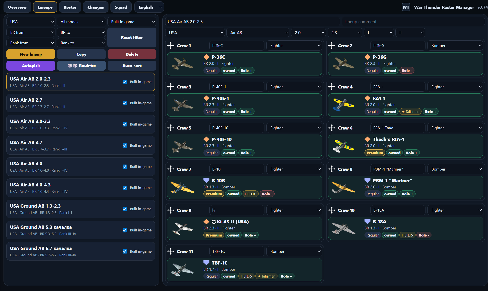
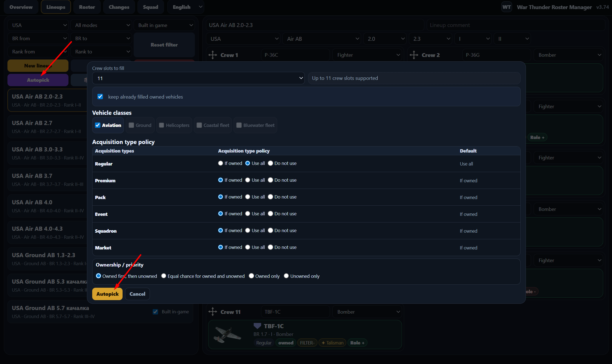
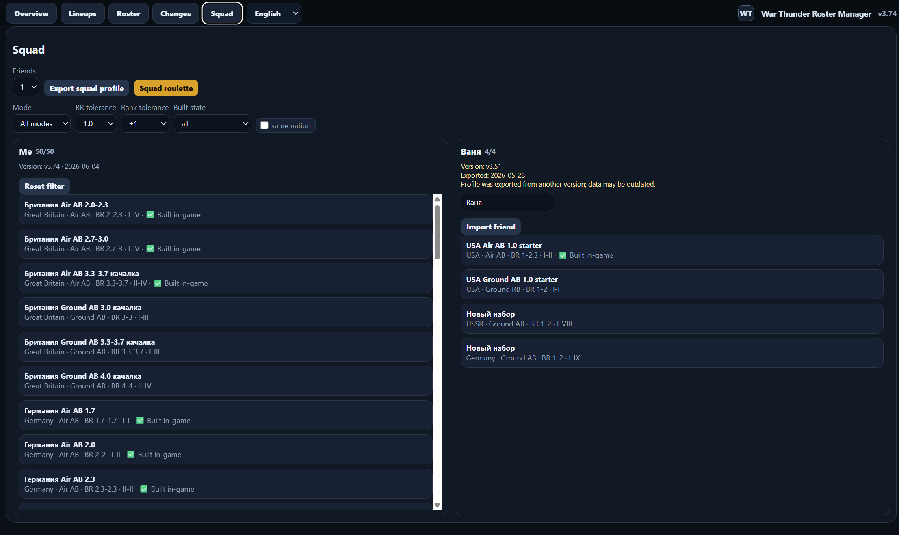

# WT Roster Manager

**WT Roster Manager** is a free local roster and lineup planning tool for War Thunder.
It adds an external planning layer on top of the game: unlimited lineups, owned-vehicle tracking, auto-pick, lineup roulette, squad compatibility and collection planning.
War Thunder has a limited number of in-game presets, and crews are trained for specific vehicles. This tool helps you keep many external lineups, rebuild old presets later, plan future research and avoid guessing which vehicle was supposed to be assigned to which crew.

**WT Roster Manager** — бесплатный локальный менеджер ангара, коллекции и наборов для War Thunder.
Он добавляет внешний слой планирования поверх игры: неограниченное количество наборов, учёт купленной техники, автоподбор, рулетку наборов, проверку совместимости для игры отрядом и планирование коллекции.
В War Thunder ограничено количество игровых наборов, а экипажи обучаются на конкретную технику. Эта программа помогает хранить много внешних наборов, восстанавливать старые пресеты, планировать прокачку и не держать в голове, какая техника должна стоять на каком экипаже.

## Documentation / документация

- [English documentation](README_EN.txt)
- [Русская документация](README_RU.txt)

## Download / Скачать

The repository also contains the full working project files, but the release ZIP is the easiest way to download the app. /
В репозитории также лежат рабочие файлы проекта, но ZIP из Releases — самый простой способ скачать программу.

Use the latest ZIP from the [**Releases**](https://github.com/IamQbcle/wt-roster-manager/releases) section / Используйте свежий ZIP из раздела [**Releases**](https://github.com/IamQbcle/wt-roster-manager/releases)

## Quickstart

1. Install Python 3 from python.org if it is not installed yet. During installation, enable **Add python.exe to PATH**.
2. Download the latest ZIP from the **Releases** section.
3. Extract the whole archive to a normal folder.
4. Run `Launch App.bat`.
5. Open the roster and mark your owned vehicles.
6. Recreate your current in-game lineups in the app.
7. Now you can plan new lineups, research goals, squad play and lineup roulette without losing your saved plans.

Detailed instructions are available in [README_EN.txt](README_EN.txt) and [README_RU.txt](README_RU.txt).

### Быстрый старт

1. Установите Python 3 с python.org, если он ещё не установлен. При установке включите галочку **Add python.exe to PATH**.
2. Скачайте свежий ZIP из раздела **Releases**.
3. Полностью распакуйте архив в обычную папку.
4. Запустите `Launch App.bat`.
5. Откройте ростер и отметьте свою купленную технику.
6. Создайте в программе ваши текущие игровые наборы.
7. Теперь можно планировать новые наборы, порядок исследования, игру отрядом и рулетку наборов, не теряя сохранённые планы.

Подробное описание функций есть в [README_RU.txt](README_RU.txt) и [README_EN.txt](README_EN.txt).

[## Feedback / Обратная связь](https://github.com/IamQbcle/wt-roster-manager/discussions)

---

## Data source / Источник данных

The vehicle database is built with help from the community War Thunder Vehicles API:

https://github.com/Sgambe33/WarThunder-Vehicles-API

Some availability corrections are maintained manually when the public API cannot fully reflect hidden, owner-only or removed vehicles.

База техники собирается с помощью стороннего War Thunder Vehicles API и данных War Thunder Wiki. Часть статусов доступности поддерживается вручную, если публичные источники не могут точно отразить скрытую, удалённую или доступную только владельцам технику.

## Disclaimer / Дисклеймер

This is an unofficial fan-made tool.  
It is not affiliated with Gaijin Entertainment or War Thunder.
Created by a non-professional developer with ChatGPT assistance.  

Это неофициальная фанатская утилита.  
Проект не связан с Gaijin Entertainment и War Thunder.
Создано непрофессиональным разработчиком при помощи ChatGPT.

## Screenshots / Скриншоты

  
  
  

<h2>Open full screenshots / Открыть все скриншоты</h2>

### Roster / Ростер

### Lineup editor / Редактор наборов

### Auto-pick / Автоподбор

### Squad compatibility / Совместимость отряда

## Platform notes / Платформы

The main tested launch method is Windows: `Launch App.bat`.
Experimental Linux/macOS scripts are included:
- `Launch_App.sh`
- `update_from_api.sh`
They may require manual permission changes, for example:

chmod +x Launch_App.sh update_from_api.sh

Linux/macOS feedback and fixes are welcome.

---

Основной проверенный способ запуска — Windows: Launch App.bat.
В архиве также есть экспериментальные скрипты для Linux/macOS:
Launch_App.sh
update_from_api.sh
Возможно, им потребуется вручную выдать права на запуск, например:

chmod +x Launch_App.sh update_from_api.sh

Проверки, багрепорты и исправления для Linux/macOS приветствуются.
